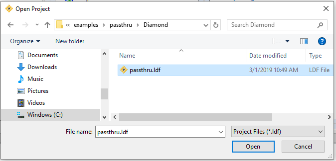
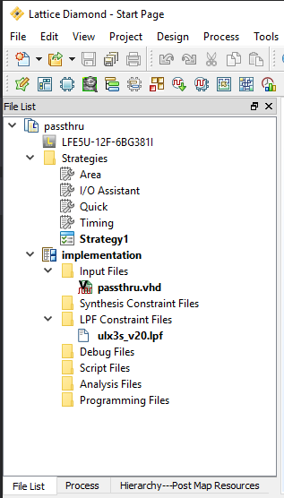
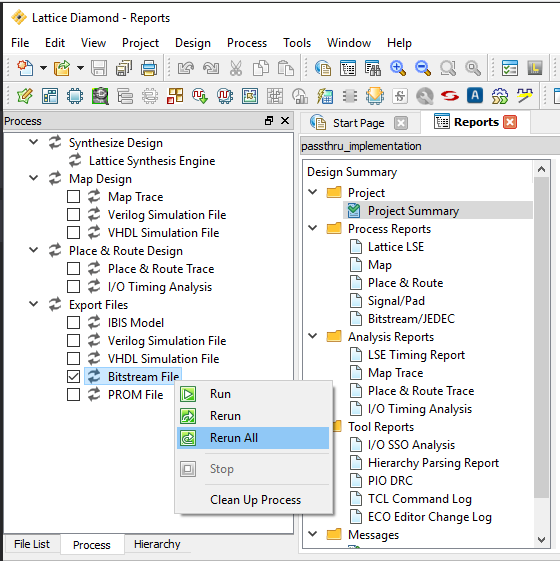

# Diamond for Windows passthru

This FPGA passthru app, needed to program the ESP32 since is it not directly accessible, is written in VHDL.

Open the Diamond lpf project file:



Note that only 2 files are needed, the [passthru.vhd](./passthru.vhd) VHDL code, and the [ulx3s_v20.lpf](./ulx3s_v20.lpf) constraint file.



Next, click on the Process tab, check the Bitstream File checkbox, right-click "Run all": 



Once the `implementation\passthru_implementation.bit` FPGA binary file is created (or copied from [examples/bin](../../bin/README.md)), it can be loaded onto the ULX3S with `ujprog`:

```
ujprog.exe Diamond_Blinky_Implementation.bit
```


For a more detailed example using Diamond, see the [Diamond Blinky Example](../../blinky/Diamond/README.md)

See also [other examples](../../README.md)
